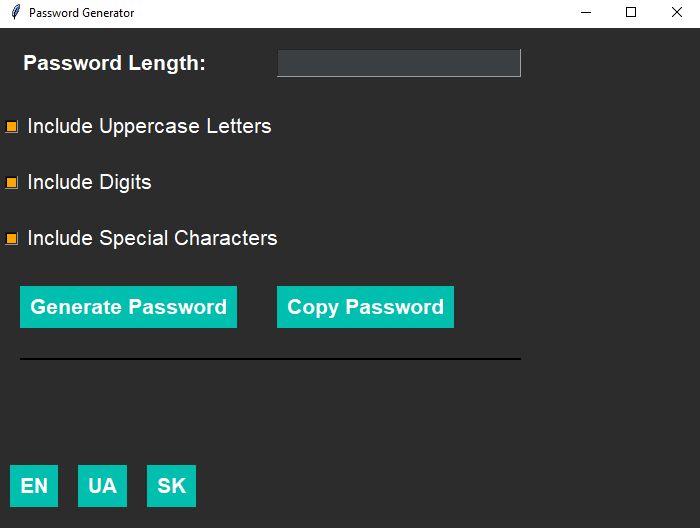
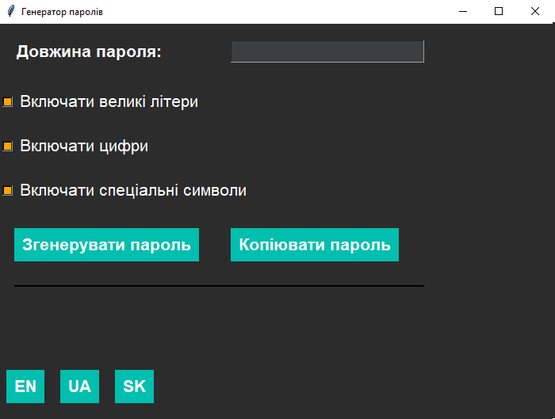
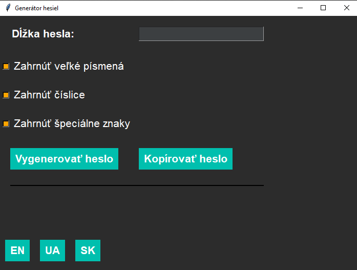
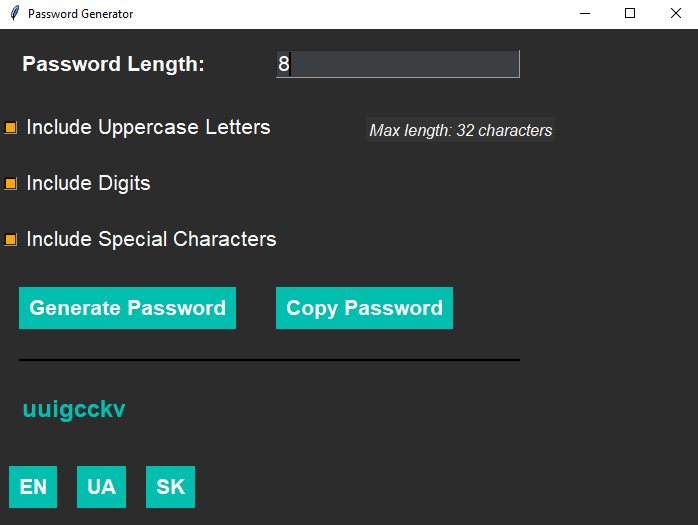

# The Greatest Password Generator

The Greatest Password Generator is a simple and user-friendly GUI application to generate strong and secure passwords. The application offers customizable options such as including uppercase letters, digits, and special characters. It also supports multiple languages (English, Ukrainian, and Slovak), making it accessible to a broader audience. 🌍🔒



## Features

- **Customizable Password Length:** Set the desired password length with a maximum of 32 characters. ✏️
- **Character Options:** Include or exclude uppercase letters, digits, and special characters. 🔠🔢
- **Multi-language Support:** Switch between English, Ukrainian, and Slovak languages. 🌐
- **Copy to Clipboard:** Easily copy the generated password to your clipboard. 📋
- **User-friendly Interface:** Minimalistic design with an easy-to-use layout. 🖥️

## Installation

### Prerequisites

- Python 3.6 or higher 🐍
- `tkinter` (Usually included with Python)
- `pyperclip` (For copying the password to the clipboard)
- `PyInstaller` (To build the executable)

### Steps

1. **Clone the Repository:**

   ```bash
   git clone https://github.com/yourusername/the-greatest-password-generator.git
   cd the-greatest-password-generator
   ```

2. **Install Dependencies:**

   Install the required dependencies using pip:

   ```bash
   pip install pyperclip
   ```

3. **Run the Application:**

   You can run the application directly using Python:

   ```bash
   python CodeGenerator.py
   ```

4. **Build the Executable (Optional):**

   If you want to create an executable for distribution:

   ```bash
   pyinstaller --onefile --windowed --icon=1.ico --name="The Greatest Password Generator" CodeGenerator.py
   ```

   After the build is complete, the executable will be found in the `dist` folder.

## Screenshots

### Main Interface


### Language Selection

  
  <br>
  
  <br>
  


### Password Generated


## Usage

1. **Set the Password Length:** Use the input field to set your desired password length (up to 32 characters). 📏
2. **Select Options:** Choose to include uppercase letters, digits, and special characters. ✅
3. **Generate Password:** Click on the "Generate Password" button to create your password. 🔄
4. **Copy Password:** Use the "Copy Password" button to copy the generated password to your clipboard. 📋
5. **Change Language:** Select your preferred language using the buttons at the bottom. 🌐

